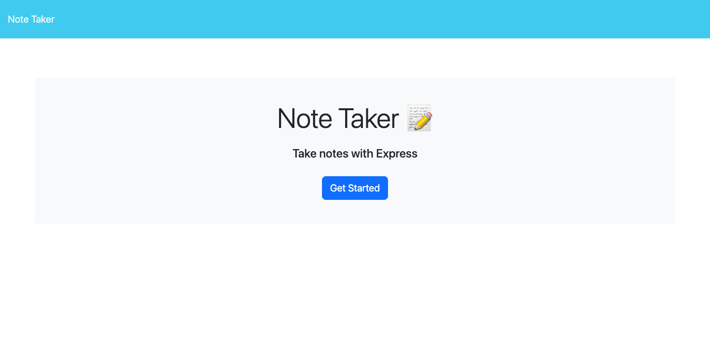

# Shellbys-Note-Taker

## Description

The Shellbys-Note-Taker application is powered by Express.js and allows the user to create and delete notes.

## Table of Contents
* [Installation](#installation)
* [Usage](#usage)
* [Application Mock Up ](#application-mock-up)

## Installation

To create your own note taker app, `git clone` the repo so you have the project on your local development environemnt.

Run `npm install` to install all dependencies. 

## Usage
To use the application locally, run `node server.js` in your CLI and open `http://localhost:3001` in your browser.

Shellbys-Note-Taker app can be used on Heroku with the following link:
https://shellbys-note-taker.herokuapp.com/ 

## Application Mock Up

The following images capture Shellby-Note-Taker application and functionality:

